# プロジェクト構造レポート

生成日時: 2025-05-17T21:05:10.207Z

## プロジェクト概要

- プロジェクト名: prompt-pocket
- バージョン: 1.0.0
- 説明: プロンプト用テンプレートリスト

## ディレクトリ構造

```
├── core/
│   ├── constants/
│   │   ├── app.ts (45 B)
│   │   └── selectors.ts (429 B)
│   └── types/
│       ├── index.ts (1.04 KB)
│       ├── messaging.ts (819 B)
│       └── ui.ts (233 B)
├── features/
│   ├── content/
│   │   └── contentScript.ts (2.25 KB)
│   ├── prompt/
│   │   └── promptService.ts (4.84 KB)
│   └── sidepanel/
│       ├── pages/
│       │   ├── CategoryManager.tsx (7.19 KB)
│       │   └── SidePanel.tsx (7.26 KB)
│       └── sidepanelScript.tsx (819 B)
├── i18n.ts (441 B)
├── locales/
│   ├── en.json (2.27 KB)
│   └── ja.json (2.89 KB)
├── pages/
│   ├── CategoryManager.tsx (7.18 KB)
│   └── SidePanel.tsx (7.29 KB)
├── shared/
│   ├── components/
│   │   ├── CategorySidebar.tsx (4.29 KB)
│   │   ├── Notification.tsx (1.39 KB)
│   │   ├── PromptItem.tsx (4.87 KB)
│   │   ├── PromptList.tsx (4.78 KB)
│   │   ├── PromptModal.tsx (10.65 KB)
│   │   └── SearchBar.tsx (1.26 KB)
│   ├── usePromptManagement.ts (8.45 KB)
│   └── utils/
│       ├── promptUtils.ts (864 B)
│       └── storage.ts (3.22 KB)
├── styles.css (624 B)
└── utils/
    └── dom.ts (1.3 KB)
```

## 主要な依存関係

- @tailwindcss/vite: ^4.1.6
- i18next: ^25.1.3
- react: ^18.2.0
- react-country-flag: ^3.1.0
- react-dom: ^18.2.0
- react-i18next: ^15.5.1
- react-icons: ^5.5.0
- tailwindcss: ^4.1.6
- @eslint/js: ^9.27.0
- @testing-library/dom: ^10.4.0
- @testing-library/jest-dom: ^6.6.3
- @types/chrome: ^0.0.322
- @types/node: ^22.15.18
- @types/react: ^18.0.26
- @types/react-dom: ^18.0.9
- @vitejs/plugin-react: ^4.2.1
- dependency-cruiser: ^16.10.2
- eslint: ^9.27.0
- eslint-plugin-react: ^7.37.5
- globals: ^16.1.0
- jsdom: ^26.1.0
- typescript: ~5.6.3
- typescript-eslint: ^8.32.1
- typescript-json-schema: ^0.65.1
- vite: ^5.4.19
- vite-tsconfig-paths: ^5.1.4
- vitest: ^3.1.3
- wxt: ^0.20.6

## モジュール間の依存関係

```mermaid
graph TD;
    src/features/content/contentScript.ts --> src/core/constants/selectors.ts
    src/features/content/contentScript.ts --> src/core/types/messaging.ts
    src/features/prompt/promptService.ts --> src/core/types/index.ts
    src/features/prompt/promptService.ts --> src/shared/utils/storage.ts
    src/shared/utils/storage.ts --> src/core/types/index.ts
    src/features/sidepanel/pages/CategoryManager.tsx --> src/core/types/index.ts
    src/features/sidepanel/pages/CategoryManager.tsx --> src/features/prompt/promptService.ts
    src/features/sidepanel/pages/SidePanel.tsx --> src/shared/components/Notification.tsx
    src/features/sidepanel/pages/SidePanel.tsx --> src/shared/components/PromptList.tsx
    src/features/sidepanel/pages/SidePanel.tsx --> src/shared/components/PromptModal.tsx
    src/features/sidepanel/pages/SidePanel.tsx --> src/shared/usePromptManagement.ts
    src/features/sidepanel/pages/SidePanel.tsx --> src/features/sidepanel/pages/CategoryManager.tsx
    src/shared/components/PromptList.tsx --> src/core/types/index.ts
    src/shared/components/PromptList.tsx --> src/features/prompt/promptService.ts
    src/shared/components/PromptList.tsx --> src/shared/components/PromptItem.tsx
    src/shared/components/PromptModal.tsx --> src/core/types/index.ts
    src/shared/components/PromptModal.tsx --> src/features/prompt/promptService.ts
    src/shared/usePromptManagement.ts --> src/core/constants/app.ts
    src/shared/usePromptManagement.ts --> src/core/types/index.ts
    src/shared/usePromptManagement.ts --> src/core/types/messaging.ts
    src/shared/usePromptManagement.ts --> src/core/types/ui.ts
    src/shared/usePromptManagement.ts --> src/features/prompt/promptService.ts
    src/shared/usePromptManagement.ts --> src/shared/utils/promptUtils.ts
    src/shared/utils/promptUtils.ts --> src/core/types/index.ts
    src/features/sidepanel/sidepanelScript.tsx --> src/features/sidepanel/pages/SidePanel.tsx
    src/features/sidepanel/sidepanelScript.tsx --> src/i18n.ts
    src/features/sidepanel/sidepanelScript.tsx --> src/styles.css
    src/i18n.ts --> src/locales/en.json
    src/i18n.ts --> src/locales/ja.json
    src/pages/CategoryManager.tsx --> src/core/types/index.ts
    src/pages/CategoryManager.tsx --> src/features/prompt/promptService.ts
    src/pages/SidePanel.tsx --> src/shared/components/Notification.tsx
    src/pages/SidePanel.tsx --> src/shared/components/PromptList.tsx
    src/pages/SidePanel.tsx --> src/shared/components/PromptModal.tsx
    src/pages/SidePanel.tsx --> src/shared/usePromptManagement.ts
    src/pages/SidePanel.tsx --> src/pages/CategoryManager.tsx
```



## ファイル統計

- 総ファイル数: 26 ファイル
- 総ディレクトリ数: 14 ディレクトリ
- 合計サイズ: 86.62 KB

